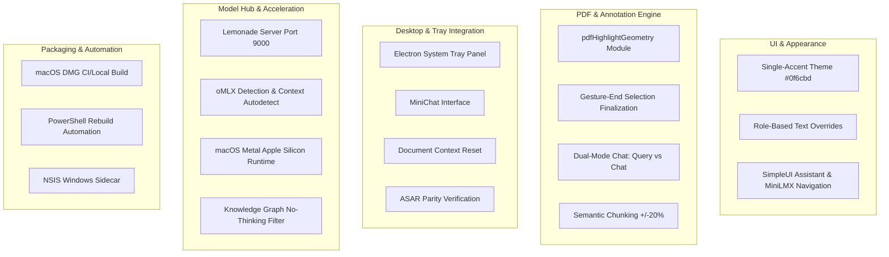

# Changes: `main` to `exp` Branch Analysis
**Repository:** `work_on_rag-main` (SimpleRAG)  
**Comparison Range:** `main..exp`  
**Cumulative Statistics:** 20 Commits | 171 Files Changed | +65,135 Additions | -41,101 Deletions  

---

## Executive Summary

Between `main` and `exp`, the **SimpleRAG (`work_on_rag-main`)** repository underwent a massive architectural evolution, transforming from a prototype local retrieval tool into an enterprise-grade, cross-platform AI workbench. The changes span five primary engineering pillars:

1. **Unified Advanced Appearance System**: Complete redesign from a dual-accent system to a clean, single-accent theme (`#0f6cbd`) with role-based text and accent overrides across both the Advanced GUI and SimpleUI.
2. **Comfy PDF Annotation & Highlighter Geometry Engine**: Implementation of mathematical rect-merging, sliver-filtering, and gesture-end selection finalization in `pdfHighlightGeometry`, paired with dual-mode PDF chat (`query` vs. `chat`) and widened semantic chunk tolerance (`+/-20%`).
3. **Electron Desktop & System Tray MiniChat**: Over 2,400 lines of tray management code (`electron_app/tray.js`), providing a persistent desktop MiniChat interface, document context reset, and instant chunk inspection controls from the system tray.
4. **Multi-Engine Local AI Runtime & Hardware Acceleration**: Full integration of Lemonade Server (`port 9000`), native oMLX model detection, Apple Silicon Metal runtime compilation, dynamic model unloading, and Knowledge Graph "no-thinking" sanitization.
5. **Cross-Platform Build & Packaging Pipeline**: Automated macOS DMG self-builds (`rebuild_dmg.sh`, GitHub Actions), PyInstaller service bundling, NSIS Windows sidecars (`installer-sidecar.nsh`), and over 30 new automated test suites.

---

## Chronological Commit History (`main..exp`)

| # | Commit | Date | Author | Commit Message / Summary |
|---|---|---|---|---|
| 1 | `3b84ec2` | 2026-08-26 | falabellamichael | `feat: publish app updates and macOS build` |
| 2 | `d84ec7e` | 2026-08-26 | falabellamichael | `docs: add macOS DMG self-build guide` |
| 3 | `01271fb` | 2026-08-26 | falabellamichael | `fix: bundle macOS service payload in DMG` |
| 4 | `802b45a` | 2026-08-26 | falabellamichael | `Fix macOS Metal runtime installation` |
| 5 | `e7e3110` | 2026-08-26 | falabellamichael | `Add oMLX model detection` |
| 6 | `d5e1a5e` | 2026-08-26 | Michael Anthony Falabella | `Fix MLX usage telemetry and model downloads` |
| 7 | `2d534c6` | 2026-08-27 | Michael Anthony Falabella | `Add Lemonade and direct AI analysis` |
| 8 | `9126080` | 2026-08-27 | Michael Anthony Falabella | `Fix Knowledge Graph no-thinking mode` |
| 9 | `ba12071` | 2026-08-27 | Michael Anthony Falabella | `Reset context for tray document summaries` |
| 10 | `b56f9ca` | 2026-08-27 | falabellamichael | `fix: harden SimpleRAG model hub and macOS service` |
| 11 | `8570cf4` | 2026-08-27 | Michael Anthony Falabella | `Fix Lemonade model unloading and PDF chat requests` |
| 12 | `48a9a3d` | 2026-08-27 | Michael Anthony Falabella | `Improve advanced vector graph interactions` |
| 13 | `c9d0a25` | 2026-08-29 | Michael Anthony Falabella | `feat(tray): add chunk controls and MiniChat` |
| 14 | `eb31c03` | 2026-08-29 | falabellamichael | `feat: route AI Home navigation through MiniLMX` |
| 15 | `3d1fef6` | 2026-09-01 | falabellamichael | `feat: consolidate SimpleUI assistant layout, background sync, and Discord bot integration` |
| 16 | `302019a` | 2026-09-01 | falabellamichael | `chore: remove discord bot variants, credentials, and tests from exp` |
| 17 | `2af8e3c` | 2026-09-02 | Davedave001 | `fix: wire Comfy PDF chat/query toggle, widen semantic chunk size tolerance to +/-20%` |
| 18 | `877e4ed` | 2026-09-02 | falabellamichael | `feat(pdf): refine Comfy text marking and highlighter interaction` |
| 19 | `e259617` | 2026-09-03 | falabellamichael | `merge: bring dev updates into exp (one-way)` |
| 20 | `3cf2236` | 2026-09-03 | falabellamichael | `feat(theme): single-accent Advanced Appearance system with role-text overrides` |

---

## The 5 Architectural Pillars

---

### Pillar 1: UI Modernization & Advanced Appearance System
- **Single-Accent Transition (`#0f6cbd`)**:
  - Replaced the prior dual-accent scheme (which combined blue with orange `#e86633`) with a unified Microsoft Fluent / VS Code style blue accent (`#0f6cbd`).
  - Standardized across `defaultTheme`, all color presets, and maintained compatibility via the `--orange` CSS alias.
  - Full bundle rebuilds of `GUI/app.bundle.js` and Comfy Vite assets.
- **Role-Based Text Overrides**:
  - Added dedicated styling rules allowing distinct text and background tint overrides depending on the message role (User, Assistant, System, Tool, Thinking).
  - Validated by new contract test suites: `tests/advanced_theme_single_accent.test.cjs` and `tests/advanced_theme_role_overrides.test.cjs`.
- **SimpleUI Assistant & Workspace Consolidation**:
  - Unified `AssistantPanel.jsx`, `ChatRail.jsx`, and `ExpandedHomeChat.jsx`.
  - Added `windowActivity.js` and `chatSessionState.js` for tab visibility and background state synchronization.
  - Implemented `SimpleUI/src/simpleRagSlots.js` allowing modular slot-based UI extensions.
  - Routed AI Home navigation through `MiniLMX` (`SimpleUI/src/api.js`, `workspace.js`).

---

### Pillar 2: Comfy PDF Workspace & Highlighter Geometry Engine
- **Gesture-End Selection Finalization (`877e4ed`)**:
  - Previously, selection rects recalculated on every `selectionchange` event, leading to torn, flickering highlights during drag selections.
  - In `SimpleUI/src/pdf/PdfPreview.jsx`, selections now finalize on `pointerup` / gesture completion, producing a single, clean highlight stroke.
- **Mathematical Highlight Geometry (`pdfHighlightGeometry.js`)**:
  - **Clipping**: Bounds highlights strictly within text element bounding boxes.
  - **Sliver Filtering**: Discards sub-pixel noise and empty boundary artifacts.
  - **Line Merging**: Horizontally fuses adjacent highlight rectangles on the same line into contiguous spans.
  - **Recolor-on-Remark**: Marking over an existing highlight recolors the mark rather than stacking duplicate DOM elements.
  - Accompanied by unit tests in `SimpleUI/src/pdf/pdfHighlightGeometry.test.js`.
- **Interactive Annotation Toolbar**:
  - Clicking any existing mark opens its annotation actions in any cursor mode.
  - The floating toolbar dynamically tracks the active highlight during page scrolling.
  - Pressing `Escape` closes the toolbar before dismissing the preview.
- **Dual Interaction Modes (`2af8e3c`)**:
  - Wired the Comfy PDF chunks toggle to switch `interaction_mode`:
    - `query`: Executes vector search retrieval per turn.
    - `chat`: Synthesizes responses strictly from existing loaded context without forced retrieval.
  - Widened semantic chunk size tolerance from strict ~60% clamping to a flexible `+/- 20%` of target chunk size.

---

### Pillar 3: Desktop System Tray MiniChat & Packaging Parity
- **Full Desktop Tray Panel (`electron_app/tray.js`)**:
  - Added 2,409 lines of standalone Electron Tray functionality.
  - Provides a desktop-accessible MiniChat window that pops up directly from the Windows taskbar or macOS menu bar.
  - Integrated real-time chunk controls for adjusting chunking parameters without opening the heavy main window.
- **Context Management for Summaries (`ba12071`)**:
  - Fixed a context leak where generating document summaries from the tray contaminated conversational memory for subsequent chat queries.
- **Tray Security & Testing**:
  - Introduced `electron_app/tray-preload.js` context isolation.
  - Created automated test harness `electron_app/tray-smoke.cjs` and `tests/electron_tray_panel.test.cjs`.
  - Added ASAR packaging parity verification (`packaging/verify_electron_asar_parity.cjs`).

---

### Pillar 4: Multi-Engine Local AI Runtime & Hardware Acceleration
- **Lemonade Server Integration (`2d534c6`, `8570cf4`)**:
  - Native discovery of local Lemonade AI servers (`http://127.0.0.1:9000`).
  - Added support for Lemonade model unloading and optimized PDF chat streaming endpoints.
  - Validated by `tests/lemonade_endpoint_detection.test.cjs` and `tests/test_lemonade_endpoint.py`.
- **oMLX Detection & Context Autodetection (`e7e3110`)**:
  - Added automatic detection for oMLX endpoints on Apple Silicon.
  - Implemented runtime context window length auto-detection (`tests/test_endpoint_context_autodetect.py`).
- **macOS Apple Silicon (Metal) Acceleration (`802b45a`, `d5e1a5e`)**:
  - Added automated build and runtime flags for compiling `llama-cpp-python` with Metal support (`GGML_METAL=on`).
  - Handled MLX telemetry tracking and reliable background model asset downloads (`GUI/llama_cpp_model_assets.py`).
- **Knowledge Graph "No-Thinking" Sanitization (`9126080`)**:
  - Strips `<think>...</think>` internal reasoning traces from AI models prior to parsing GraphViz / D3 graph nodes, preventing corrupt JSON/GQL syntax.
- **Advanced Vector Graph Interactivity (`48a9a3d`)**:
  - Enhanced graph canvas rendering, node capacity, and edge visibility (`GUI/advanced_hybrid_graph.js`).

---

### Pillar 5: Build Systems, Distribution & Packaging
- **macOS DMG Distribution Pipeline (`01271fb`, `d84ec7e`, `rebuild_dmg.sh`)**:
  - Complete `.github/workflows/build-macos-dmg.yml` workflow for automated DMG generation.
  - Included `requirements-macos.txt` tailored for Apple Silicon runtime dependencies.
  - Bundled the Python backend service directly into the macOS app bundle (`electron_service.spec`).
- **Windows Executables & Automation Scripts**:
  - Updated all central build scripts:
    - `rebuild_all_exes.ps1`
    - `rebuild_electron_exes.ps1`
    - `rebuild_sprout_fix.ps1`
    - `rebuild_standalone.ps1`
  - Added NSIS sidecar script `electron_app/installer-sidecar.nsh` to bundle runtime dependencies into the Windows installer.
- **Discord Bot Variant Cleanup (`302019a`)**:
  - In commit `3d1fef6`, Discord bot integrations were tested. In commit `302019a`, the branch was pruned of external bot variants, temporary tokens, and Discord tests to keep `exp` lightweight, secure, and focused on the desktop core.

---

## Comprehensive Subsystem File Breakdown

### 1. SimpleUI (React / Vite Frontend)
| Path | Key Changes |
| :--- | :--- |
| `SimpleUI/src/pdf/PdfPreview.jsx` | Rewrote selection engine for gesture-end finalization; integrated highlight geometry merging |
| `SimpleUI/src/pdf/pdfHighlightGeometry.js` | **[NEW]** Geometry algorithms for rect clipping, line merging, and sliver filtering |
| `SimpleUI/src/pdf/pdfHighlightGeometry.test.js` | **[NEW]** Unit tests covering highlight bounding box mathematics |
| `SimpleUI/src/styles.css` | 1,926 lines modified: Single-accent theme (#0f6cbd) and role-based accent color tokens |
| `SimpleUI/src/pdf.css` | Styles for annotation toolbars, recolored highlights, and responsive PDF zoom |
| `SimpleUI/src/modelSelectionSync.js` | **[NEW]** Multi-tab synchronization for selected model endpoints |
| `SimpleUI/src/simpleRagSlots.js` | **[NEW]** Extension slots allowing third-party plug-ins to mount into SimpleUI |
| `SimpleUI/src/workspace.js` | Over 1,000 lines updated: Unified workspace state, PDF preview integration, MiniLMX routing |
| `SimpleUI/src/chatSessionState.js` | **[NEW]** Centralized chat session and message state persistence |
| `SimpleUI/src/windowActivity.js` | **[NEW]** Window focus and activity detection for streaming sync |

### 2. Backend Services & Python Core (`GUI/`)
| Path | Key Changes |
| :--- | :--- |
| `GUI/router.py` | Expanded by 830+ lines: Lemonade routing, oMLX detection, context limits, and model unloading |
| `GUI/simple_rag_server.py` | Added server endpoint wiring, multi-client dispatch, and background task telemetry |
| `GUI/simple_rag_runtime.py` | **[NEW]** Runtime lifecycle management for embedding engines and model workers |
| `GUI/pdf_parser.py` | Added semantic chunk size tolerance (+/- 20%) and explicit chunk extraction |
| `GUI/explicit_chunk_retrieval.py` | **[NEW]** Dedicated retriever for exact chunk ID and index-based lookups |
| `GUI/llama_cpp_runtime.py` | Added macOS Metal runtime detection and dynamic compilation flags |
| `GUI/llama_cpp_model_assets.py` | Asset integrity validation, remote model catalog, and download resume logic |
| `GUI/style.css` | 6,479 lines updated: Overhauled Advanced GUI styling for the single-accent design system |

### 3. Desktop Application (`electron_app/`)
| Path | Key Changes |
| :--- | :--- |
| `electron_app/tray.js` | **[NEW]** 2,409 lines implementing the desktop System Tray MiniChat and chunk controls |
| `electron_app/tray-preload.js` | **[NEW]** Secure context isolation bridge for the tray window |
| `electron_app/tray-smoke.cjs` | **[NEW]** Comprehensive test harness for tray interactions |
| `electron_app/main.js` | Server attachment logic, multi-window management, and macOS dock behavior |
| `electron_app/installer-sidecar.nsh` | **[NEW]** NSIS Windows installer hook for bundled Python dependencies |
| `electron_app/electron-builder-macos.json` | **[NEW]** macOS packaging configuration for DMG and arm64 targets |

### 4. Build, Packaging & CI/CD
| Path | Key Changes |
| :--- | :--- |
| `rebuild_dmg.sh` | **[NEW]** Shell script for compiling and packaging the macOS DMG on Apple Silicon |
| `.github/workflows/build-macos-dmg.yml` | **[NEW]** GitHub Actions automated workflow for macOS releases |
| `rebuild_all_exes.ps1` | Updated PyInstaller invocation commands and output artifact verification |
| `packaging/verify_electron_asar_parity.cjs` | **[NEW]** Validates file parity inside packaged Electron ASAR archives |
| `packaging/smoke_test_electron_service.py` | End-to-end smoke testing of packaged Electron service binaries |

---

## Verification & Test Suites

The `exp` branch introduced over **30 new automated test suites** across Node.js (`node:test`) and Python (`pytest`), ensuring high reliability across all added features:

### Appearance & Theme Tests
- `tests/advanced_theme_single_accent.test.cjs`: Confirms elimination of dual orange accents and enforces `#0f6cbd` across all presets.
- `tests/advanced_theme_role_overrides.test.cjs`: Validates that role-based text overrides apply correctly in the DOM.

### PDF & Geometry Tests
- `SimpleUI/src/pdf/pdfHighlightGeometry.test.js`: Mathematical verification of rect clipping, sliver elimination, and horizontal line merging.
- `tests/test_pdf_chat_explicit_chunks.py`: Verifies explicit chunk extraction and citation mapping.
- `tests/simpleui_pdf_preview_resize.test.mjs`: Tests responsive layout resizing during PDF viewing.

### Desktop Tray Tests
- `tests/electron_tray_panel.test.cjs`: Verifies tray window spawning, visibility toggling, and context isolation.
- `electron_app/tray-smoke.cjs`: End-to-end automated smoke test exercising tray chat and chunk sliders.

### Model & Endpoint Tests
- `tests/lemonade_endpoint_detection.test.cjs` & `tests/test_lemonade_endpoint.py`: Validates detection, model switching, and chat requests against Lemonade Server.
- `tests/omlx_endpoint_detection.test.cjs`: Validates oMLX detection and connection lifecycle.
- `tests/test_endpoint_context_autodetect.py`: Verifies automatic detection of model context window boundaries.
- `tests/electron_macos_packaging.test.cjs` & `tests/test_macos_python_discovery.py`: Tests macOS service discovery and DMG packaging integrity.
